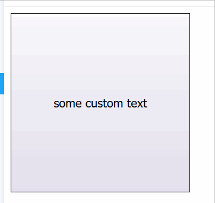

# recursive-buttons

recursive-buttons is a simple decorative react component that you can import as a library. It's inspired by a geometric shape called [Sierpinski carpet](https://en.wikipedia.org/wiki/Sierpinski_carpet) and bubble wrap popping.



### Install

`npm install recursive-buttons --save`

### Example usage

```jsx
import React from 'react';
import { RecursiveButtons } from 'recursive-buttons';

// you have to wrap recursiveButtons with a parent with its own height
const componentWithRecursiveButtons = () => (
  <div style={{ width: '200px', height: '200px' }}>
    <RecursiveButtons text="hover over me" hover />
  </div>
);
```

### Storybook

https://recursive-buttons-docs.mcalus.dev

## API

### import

```jsx
import { RecursiveButtons } from 'recursive-buttons';
```

### Props

| Name         | Type    | Default     | Description                                                                                  |
| :----------- | :------ | :---------- | :------------------------------------------------------------------------------------------- |
| touchEnabled | boolean | true        | enables touchscreen support                                                                  |
| hoverMode    | boolean | false       | enables hover mode (buttons are being clicked when you hover over them)                      |
| text         | string  | 'click me!' | text that is displayed on the initial button. Fill with empty string to not display any text |
